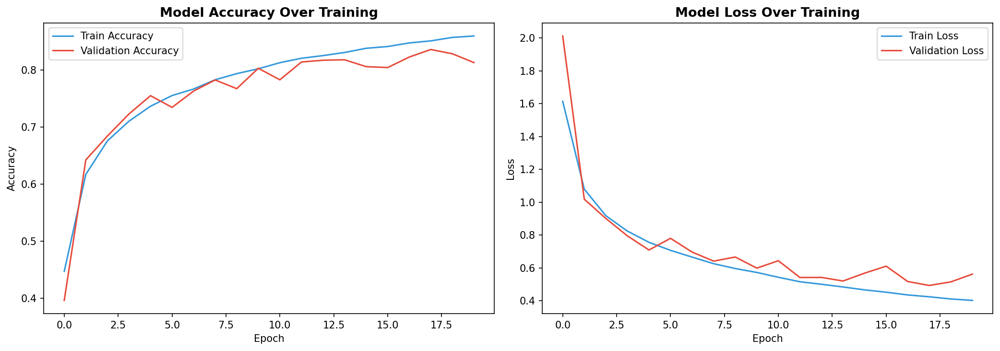
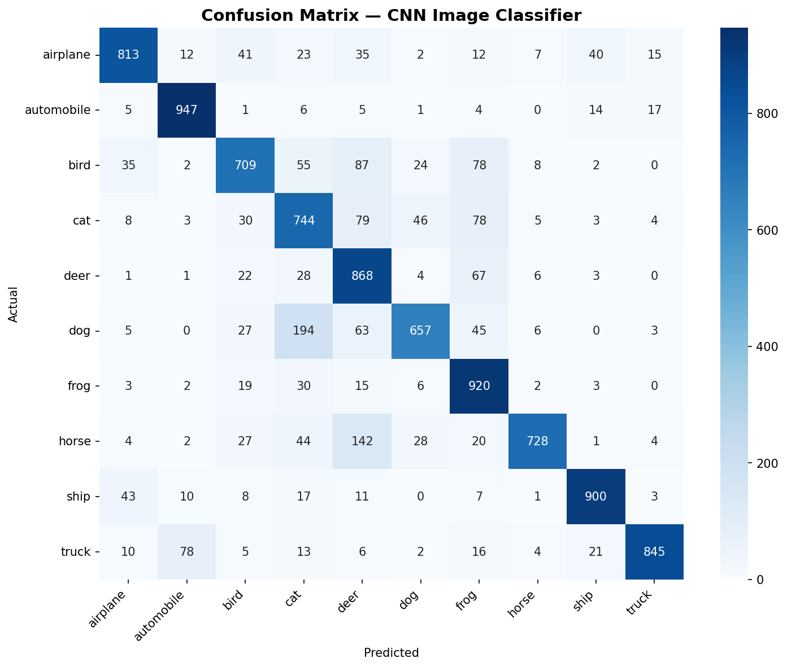
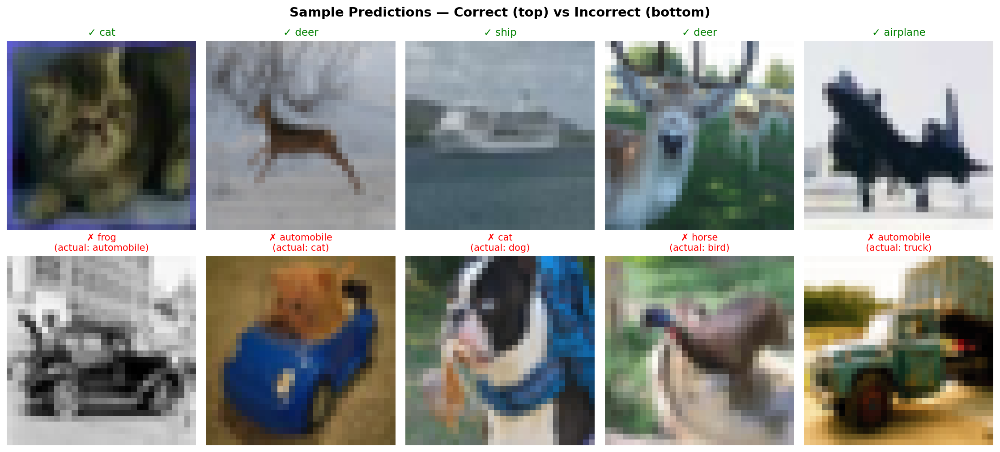

# CNN Image Classifier — CIFAR-10

Classifies images into 10 categories using a convolutional neural network 
built from scratch, achieving 83.4% validation accuracy.

## Problem
Image classification is foundational to computer vision applications — 
from product categorization to defect detection to autonomous systems.

## Approach
- Custom CNN architecture: 3 convolutional blocks (Conv2D + BatchNorm + 
  MaxPooling + Dropout) trained from scratch — no transfer learning
- Trained on 50,000 images across 10 classes (CIFAR-10)
- Evaluated via training curves, confusion matrix, and per-class metrics
- Analyzed correct vs incorrect predictions for error patterns

## Results

**83.4% validation accuracy**

Strongest performance: automobile (93% F1), ship (90% F1)
Weakest: cat (70% F1) — a known challenge in this dataset due to pose 
and lighting variation, consistent with published CIFAR-10 benchmarks.

## Tech Stack
Python · TensorFlow/Keras · NumPy · Matplotlib · Seaborn

## Try It
View the full notebook on [Kaggle](https://www.kaggle.com/code/aseermuntaqueemarko/cnn-image-classifier) 
or open `notebook.ipynb` here in Jupyter/Colab.

Dataset: CIFAR-10
